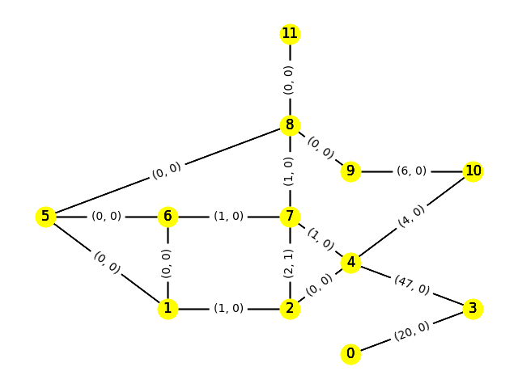

# Report. Lab3
Бабич Никита Станиславович 312400 Z33434 3 курс

## Цель
Познакомить студента с инструментами, направленными на решение задач, использующих
графовые модели.

## Methods
Построил упрощения: дороги = грани графа, вес двумерный (в одну и другую стороны)
Реализован подход в оптимизации:

    Для каждого водителя проверяется загруженность дороги в прошылй тик, если дорога была занята - 
    водитель выберет другое направление, либо будет ожидать когда дорога освободится, 
    если другие направления также заянты.

Таким образом для решения задачи используются методы динамического программирования. Оптимизация состоит в использовании
модели оценки загруженности дорог, вместо расчета уникального маршрута для каждого водителя 

## Model view

## Conclusion
Методы динамического программирования, как и методы термодинамических обобщений (перехода от рассмотрения частных элементов 
взаимодействующей системы к общим параметрам (концентрация, объем, давление, температура)) позволяют значительно ускорить 
решение задач (как мне кажется NP-трудной в данном случае), но не позволяют получить точное решение, а лишь оценку оптимальности.